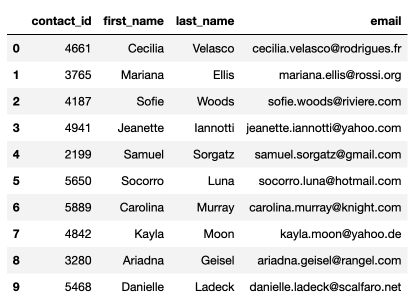

# Crowdfunding_ETL
Building an ETL pipeline using Python and Pandas to extract and transform data and PostgreSQL with pgAdmin to load
- - -

- - -
## Project Structure

- Original source data (Excel files) can be found in the [Resources](Resources/) folder.  
- All project code files can be found in the [Project_Files](Project_Files/) folder.  
- All CSV output files generated from the transformations can be found in the [Output](Output/) folder.

### Deliverable #1:
**Jupyter Notebook Extract/Transform:** [Crowdfunding_ETL.ipynb](Project_Files/Crowdfunding_ETL.ipynb)  
Run this file to generate CSV output files from the cleaned dataframes created:  
#### Campaign Subcategory:
  
#### Campaign Category:
  
#### Contact Information:
  
#### Campaign:

### Deliverable #2:
**Entity Relationship Diagram:** [Crowdfunding_ERD.png](Project_Files/Crowdfunding_ERD.png)  
Visualization of the cleaned tables & their relationships:

### Deliverable #3:
**Database Schema:** [crowdfunding_db_schema.sql](Project_Files/crowdfunding_db_schema.sql)  
See directions in the comments of this file for how to load this information into pgAdmin to create the database & load all CSV files:

- - -